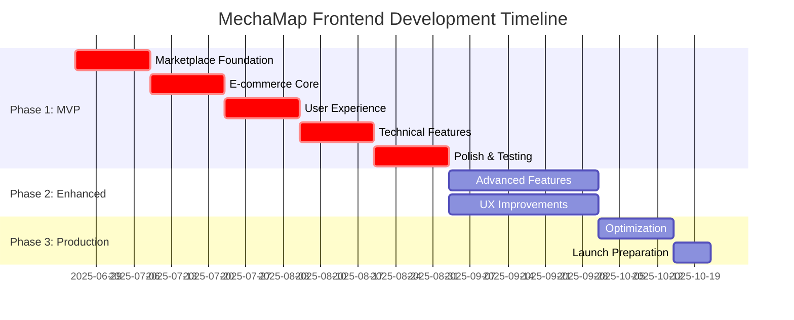

# 🚀 **MECHAMAP FRONTEND DEVELOPMENT ROADMAP**

**Project**: MechaMap User-Facing Interface Development  
**Timeline**: 16-22 weeks to Production Ready  
**Priority**: CRITICAL for Business Viability  
**Budget**: $32,500-$40,000 estimated  

---

## 🎯 **ROADMAP OVERVIEW**

### **Current State**: 35% Complete
### **Target State**: 100% Production Ready
### **Critical Path**: Marketplace Frontend → User Experience → Technical Features



---

## 📋 **PHASE 1: CRITICAL MVP FEATURES (10 weeks)**

### **🎯 MILESTONE 1: Marketplace Foundation (Weeks 1-2)**

#### **Week 1: Product Catalog Interface**
**Deliverables:**
- [ ] Product grid/list view components
- [ ] Category navigation system
- [ ] Basic product filtering
- [ ] Product card design system
- [ ] Responsive layout implementation

**Technical Tasks:**
```javascript
// Vue.js Components to Build
- ProductGrid.vue
- ProductCard.vue
- CategoryNav.vue
- FilterSidebar.vue
- ProductList.vue
```

**Effort Breakdown:**
- UI/UX Design: 8 hours
- Component Development: 24 hours
- API Integration: 8 hours
- **Total: 40 hours**

#### **Week 2: Product Detail Pages**
**Deliverables:**
- [ ] Product information display
- [ ] Image gallery with zoom
- [ ] Specifications table
- [ ] Related products section
- [ ] Add to cart functionality

**Technical Tasks:**
```javascript
// Components & Features
- ProductDetail.vue
- ImageGallery.vue
- SpecTable.vue
- RelatedProducts.vue
- AddToCartButton.vue
```

**Effort Breakdown:**
- Component Development: 20 hours
- Image handling: 6 hours
- API Integration: 4 hours
- **Total: 30 hours**

### **🎯 MILESTONE 2: E-commerce Core (Weeks 3-4)**

#### **Week 3: Shopping Cart System**
**Deliverables:**
- [ ] Shopping cart UI component
- [ ] Add/remove/update cart items
- [ ] Cart persistence (localStorage)
- [ ] Cart summary calculations
- [ ] Mini cart dropdown

**Technical Implementation:**
```javascript
// Pinia Store Structure
const useCartStore = defineStore('cart', {
  state: () => ({
    items: [],
    total: 0,
    itemCount: 0
  }),
  actions: {
    addItem(product, quantity),
    removeItem(productId),
    updateQuantity(productId, quantity),
    clearCart()
  }
})
```

**Effort Breakdown:**
- State Management: 10 hours
- UI Components: 15 hours
- Cart Logic: 8 hours
- Testing: 2 hours
- **Total: 35 hours**

#### **Week 4: Checkout Process**
**Deliverables:**
- [ ] Multi-step checkout flow
- [ ] Address management
- [ ] Payment method selection
- [ ] Order summary
- [ ] Order confirmation page

**Checkout Flow:**
```
Step 1: Cart Review
Step 2: Shipping Address
Step 3: Payment Method
Step 4: Order Review
Step 5: Confirmation
```

**Effort Breakdown:**
- Checkout Components: 25 hours
- Form Validation: 8 hours
- Payment Integration: 10 hours
- Order Processing: 2 hours
- **Total: 45 hours**

### **🎯 MILESTONE 3: User Experience (Weeks 5-6)**

#### **Week 5: User Dashboard**
**Deliverables:**
- [ ] User profile management
- [ ] Order history display
- [ ] Account settings
- [ ] Wishlist functionality
- [ ] Download history

**Dashboard Sections:**
```
├── Profile Overview
├── Order Management
├── Wishlist
├── Downloads
├── Account Settings
└── Support
```

**Effort Breakdown:**
- Dashboard Layout: 15 hours
- Profile Components: 15 hours
- Order History: 8 hours
- Settings: 2 hours
- **Total: 40 hours**

#### **Week 6: Search & Discovery**
**Deliverables:**
- [ ] Advanced search interface
- [ ] Filter system (price, category, type)
- [ ] Search results page
- [ ] Auto-suggestions
- [ ] Search history

**Search Features:**
```javascript
// Search Functionality
- Text search with autocomplete
- Category filtering
- Price range filtering
- Seller type filtering
- Sort options (price, popularity, date)
- Search result pagination
```

**Effort Breakdown:**
- Search Interface: 12 hours
- Filter Components: 10 hours
- API Integration: 6 hours
- Auto-complete: 2 hours
- **Total: 30 hours**

### **🎯 MILESTONE 4: Technical Features (Weeks 7-8)**

#### **Week 7-8: Technical Content Browser**
**Deliverables:**
- [ ] CAD file listings
- [ ] Technical drawings gallery
- [ ] Materials database interface
- [ ] File download management
- [ ] Preview functionality

**Technical Components:**
```javascript
// Technical Content System
- TechnicalDrawingsList.vue
- CADFileViewer.vue
- MaterialsDatabase.vue
- FileDownloadManager.vue
- PreviewModal.vue
```

**Effort Breakdown:**
- File Listing Components: 20 hours
- Preview System: 15 hours
- Download Management: 10 hours
- Materials Interface: 5 hours
- **Total: 50 hours**

### **🎯 MILESTONE 5: Polish & Testing (Weeks 9-10)**

#### **Week 9: Mobile Optimization**
**Deliverables:**
- [ ] Mobile-first responsive design
- [ ] Touch-friendly interactions
- [ ] Mobile navigation optimization
- [ ] Performance optimization
- [ ] Progressive Web App features

**Mobile Enhancements:**
```css
/* Mobile-First Approach */
@media (min-width: 768px) { /* Tablet */ }
@media (min-width: 1024px) { /* Desktop */ }
@media (min-width: 1280px) { /* Large Desktop */ }
```

**Effort Breakdown:**
- Responsive Design: 15 hours
- Mobile Navigation: 6 hours
- Touch Optimization: 4 hours
- **Total: 25 hours**

#### **Week 10: Testing & Bug Fixes**
**Deliverables:**
- [ ] Cross-browser testing
- [ ] Accessibility testing
- [ ] Performance testing
- [ ] User acceptance testing
- [ ] Bug fixes and optimization

**Testing Checklist:**
- [ ] Chrome, Firefox, Safari, Edge compatibility
- [ ] Mobile device testing (iOS/Android)
- [ ] Accessibility compliance (WCAG 2.1)
- [ ] Performance benchmarks
- [ ] Security testing

**Effort Breakdown:**
- Testing: 15 hours
- Bug Fixes: 15 hours
- Documentation: 5 hours
- **Total: 35 hours**

---

## 🚀 **PHASE 2: ENHANCED FEATURES (6 weeks)**

### **🎯 MILESTONE 6: Advanced Marketplace (Weeks 11-13)**

#### **Advanced E-commerce Features**
**Deliverables:**
- [ ] Product reviews and ratings system
- [ ] Seller profiles and store pages
- [ ] Advanced product comparison
- [ ] Wishlist with sharing
- [ ] Recently viewed products

**New Components:**
```javascript
// Advanced Features
- ProductReviews.vue
- SellerProfile.vue
- ProductComparison.vue
- WishlistManager.vue
- RecentlyViewed.vue
```

**Effort Breakdown:**
- Reviews System: 25 hours
- Seller Profiles: 20 hours
- Product Comparison: 15 hours
- Wishlist Enhancement: 10 hours
- **Total: 70 hours**

### **🎯 MILESTONE 7: Technical Enhancements (Weeks 14-16)**

#### **Advanced Technical Features**
**Deliverables:**
- [ ] CAD file viewer integration
- [ ] 3D model preview
- [ ] Technical documentation system
- [ ] Engineering calculation tools
- [ ] Material property database

**Technical Stack:**
```javascript
// 3D Viewer Integration
- Three.js for 3D rendering
- CAD file format support
- Interactive 3D controls
- Material property visualization
```

**Effort Breakdown:**
- CAD Viewer: 40 hours
- 3D Preview: 30 hours
- Documentation System: 25 hours
- Calculation Tools: 15 hours
- **Total: 110 hours**

---

## 🎨 **PHASE 3: OPTIMIZATION & PRODUCTION (3 weeks)**

### **🎯 MILESTONE 8: Performance & SEO (Weeks 17-18)**

#### **Production Optimization**
**Deliverables:**
- [ ] Progressive Web App implementation
- [ ] Advanced caching strategies
- [ ] SEO optimization
- [ ] Analytics integration
- [ ] Performance monitoring

**PWA Features:**
```javascript
// Service Worker Implementation
- Offline functionality
- Push notifications
- App-like experience
- Background sync
```

**Effort Breakdown:**
- PWA Implementation: 20 hours
- SEO Optimization: 15 hours
- Analytics Setup: 8 hours
- Performance Tuning: 12 hours
- **Total: 55 hours**

### **🎯 MILESTONE 9: Launch Preparation (Week 19)**

#### **Production Readiness**
**Deliverables:**
- [ ] Production deployment setup
- [ ] Monitoring and logging
- [ ] Error tracking
- [ ] User documentation
- [ ] Admin training materials

**Launch Checklist:**
- [ ] SSL certificate configuration
- [ ] CDN setup for assets
- [ ] Database optimization
- [ ] Security audit
- [ ] Performance benchmarking
- [ ] Backup procedures

**Effort Breakdown:**
- Deployment Setup: 15 hours
- Documentation: 10 hours
- Training Materials: 8 hours
- Final Testing: 7 hours
- **Total: 40 hours**

---

## 💰 **DETAILED BUDGET BREAKDOWN**

### **Phase 1: MVP Development**
| Milestone | Hours | Rate | Cost |
|-----------|-------|------|------|
| Marketplace Foundation | 70h | $50 | $3,500 |
| E-commerce Core | 80h | $50 | $4,000 |
| User Experience | 70h | $50 | $3,500 |
| Technical Features | 50h | $50 | $2,500 |
| Polish & Testing | 60h | $50 | $3,000 |
| **Phase 1 Total** | **330h** | **$50** | **$16,500** |

### **Phase 2: Enhanced Features**
| Milestone | Hours | Rate | Cost |
|-----------|-------|------|------|
| Advanced Marketplace | 70h | $50 | $3,500 |
| Technical Enhancements | 110h | $50 | $5,500 |
| **Phase 2 Total** | **180h** | **$50** | **$9,000** |

### **Phase 3: Production**
| Milestone | Hours | Rate | Cost |
|-----------|-------|------|------|
| Performance & SEO | 55h | $50 | $2,750 |
| Launch Preparation | 40h | $50 | $2,000 |
| **Phase 3 Total** | **95h** | **$50** | **$4,750** |

### **Total Project Cost**
- **Total Hours**: 605 hours
- **Total Cost**: $30,250
- **Contingency (15%)**: $4,538
- **Final Budget**: $34,788

---

## 👥 **TEAM STRUCTURE & RESPONSIBILITIES**

### **Core Team (Recommended)**

#### **Frontend Developer (Lead)**
- **Commitment**: Full-time (40h/week)
- **Responsibilities**:
  - Vue.js component development
  - State management implementation
  - API integration
  - Performance optimization
- **Skills Required**: Vue.js 3, TypeScript, Tailwind CSS

#### **UI/UX Designer**
- **Commitment**: Part-time (20h/week)
- **Responsibilities**:
  - Design system creation
  - User interface design
  - User experience optimization
  - Accessibility compliance
- **Skills Required**: Figma, Design Systems, UX Research

#### **Backend Developer (Support)**
- **Commitment**: Part-time (10h/week)
- **Responsibilities**:
  - API endpoint optimization
  - Database query optimization
  - Integration support
  - Performance monitoring
- **Skills Required**: Laravel, MySQL, API Design

#### **QA Tester**
- **Commitment**: Part-time (15h/week)
- **Responsibilities**:
  - Manual testing
  - Automated test creation
  - Cross-browser testing
  - Performance testing
- **Skills Required**: Cypress, Jest, Manual Testing

---

## 🛠️ **TECHNOLOGY STACK DECISIONS**

### **Frontend Framework: Vue.js 3**
**Rationale:**
- Excellent Laravel integration
- Gentle learning curve
- Strong ecosystem
- Great performance

**Alternative Considered:**
- React (More complex setup)
- Alpine.js (Limited for complex features)

### **Build Tool: Vite**
**Benefits:**
- Fast development server
- Optimized production builds
- Great Vue.js integration
- Modern ES modules support

### **CSS Framework: Tailwind CSS**
**Advantages:**
- Utility-first approach
- Excellent customization
- Small production bundle
- Great developer experience

### **State Management: Pinia**
**Features:**
- Vue 3 optimized
- TypeScript support
- Devtools integration
- Simple API

### **HTTP Client: Axios**
**Benefits:**
- Request/response interceptors
- Automatic JSON handling
- Error handling
- Laravel Sanctum integration

---

## 📊 **SUCCESS METRICS & KPIs**

### **Development Metrics**
- **Code Coverage**: >80%
- **Performance Score**: >90 (Lighthouse)
- **Accessibility Score**: >95 (WCAG 2.1)
- **Bundle Size**: <500KB gzipped
- **Page Load Time**: <2 seconds

### **User Experience Metrics**
- **User Registration Rate**: >80%
- **Cart Abandonment Rate**: <30%
- **Mobile Usage**: >60%
- **Session Duration**: >5 minutes
- **Return User Rate**: >40%

### **Business Metrics**
- **Product Page Views**: Track engagement
- **Conversion Rate**: >2%
- **Average Order Value**: Monitor growth
- **User-Generated Content**: Reviews, ratings
- **Support Ticket Reduction**: Self-service usage

---

## ⚠️ **RISK MITIGATION STRATEGIES**

### **Technical Risks**

#### **Risk 1: API Integration Complexity**
- **Probability**: Medium
- **Impact**: High
- **Mitigation**: 
  - Early API testing and documentation
  - Mock API development for parallel work
  - Regular backend team collaboration

#### **Risk 2: Performance Issues**
- **Probability**: Medium
- **Impact**: Medium
- **Mitigation**:
  - Performance testing throughout development
  - Code splitting and lazy loading
  - CDN implementation for assets

#### **Risk 3: Mobile Compatibility**
- **Probability**: Low
- **Impact**: High
- **Mitigation**:
  - Mobile-first development approach
  - Regular device testing
  - Progressive enhancement strategy

### **Project Risks**

#### **Risk 4: Scope Creep**
- **Probability**: High
- **Impact**: High
- **Mitigation**:
  - Clear milestone definitions
  - Regular stakeholder reviews
  - Change request process

#### **Risk 5: Resource Availability**
- **Probability**: Medium
- **Impact**: High
- **Mitigation**:
  - Cross-training team members
  - Documentation of all processes
  - Backup resource identification

---

## 🎯 **QUALITY ASSURANCE PLAN**

### **Testing Strategy**

#### **Unit Testing**
- **Framework**: Vitest
- **Coverage Target**: >80%
- **Focus Areas**: 
  - Component logic
  - State management
  - Utility functions

#### **Integration Testing**
- **Framework**: Cypress
- **Coverage**: Critical user flows
- **Focus Areas**:
  - Shopping cart flow
  - Checkout process
  - User authentication

#### **End-to-End Testing**
- **Framework**: Playwright
- **Coverage**: Complete user journeys
- **Focus Areas**:
  - Product discovery to purchase
  - User registration to first order
  - Mobile user experience

### **Code Quality Standards**

#### **Code Review Process**
- All code must be reviewed before merge
- Automated linting with ESLint
- Prettier for code formatting
- TypeScript for type safety

#### **Performance Standards**
- Lighthouse score >90
- First Contentful Paint <1.5s
- Largest Contentful Paint <2.5s
- Cumulative Layout Shift <0.1

---

## 📅 **MILESTONE DELIVERY SCHEDULE**

### **Weekly Deliverables**

| Week | Milestone | Deliverable | Demo Date |
|------|-----------|-------------|-----------|
| 1 | Product Catalog | Working product grid | Week 1 Friday |
| 2 | Product Details | Complete product pages | Week 2 Friday |
| 3 | Shopping Cart | Functional cart system | Week 3 Friday |
| 4 | Checkout | Complete checkout flow | Week 4 Friday |
| 5 | User Dashboard | User account management | Week 5 Friday |
| 6 | Search System | Advanced search & filters | Week 6 Friday |
| 7-8 | Technical Features | CAD/Technical content | Week 8 Friday |
| 9 | Mobile Optimization | Mobile-ready interface | Week 9 Friday |
| 10 | Testing & Polish | Production-ready MVP | Week 10 Friday |

### **Major Milestone Reviews**

#### **MVP Review (Week 10)**
- **Stakeholders**: All team members, product owner
- **Deliverable**: Fully functional MVP
- **Success Criteria**: All critical features working
- **Go/No-Go Decision**: Proceed to Phase 2

#### **Enhanced Features Review (Week 16)**
- **Stakeholders**: Business team, technical team
- **Deliverable**: Feature-complete application
- **Success Criteria**: Advanced features implemented
- **Go/No-Go Decision**: Proceed to production prep

#### **Production Readiness Review (Week 19)**
- **Stakeholders**: All stakeholders
- **Deliverable**: Production-ready application
- **Success Criteria**: Performance, security, accessibility
- **Go/No-Go Decision**: Launch approval

---

## 🚀 **LAUNCH STRATEGY**

### **Soft Launch (Week 20)**
- **Audience**: Internal team and beta users
- **Duration**: 1 week
- **Goals**: 
  - Identify critical issues
  - Gather user feedback
  - Performance validation

### **Public Launch (Week 21)**
- **Audience**: All users
- **Marketing**: Coordinated announcement
- **Support**: Full support team ready
- **Monitoring**: Real-time performance tracking

### **Post-Launch (Week 22+)**
- **Monitoring**: 24/7 system monitoring
- **Support**: User support and bug fixes
- **Iteration**: Based on user feedback
- **Analytics**: Performance and usage analysis

---

## 📈 **CONTINUOUS IMPROVEMENT PLAN**

### **Monthly Reviews**
- Performance metrics analysis
- User feedback incorporation
- Feature usage analytics
- Technical debt assessment

### **Quarterly Enhancements**
- New feature development
- Performance optimizations
- Security updates
- User experience improvements

### **Annual Roadmap**
- Major feature additions
- Technology stack updates
- Scalability improvements
- Market expansion features

---

**This roadmap provides a comprehensive path from the current 35% completion to a fully production-ready MechaMap frontend that will serve the mechanical engineering community effectively.**
