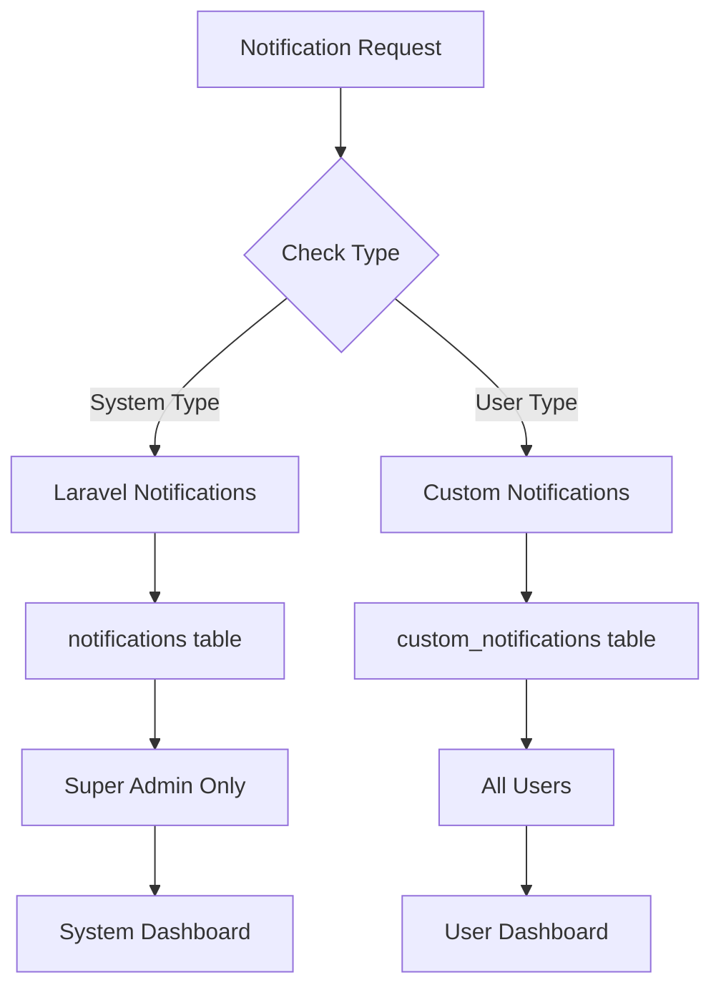
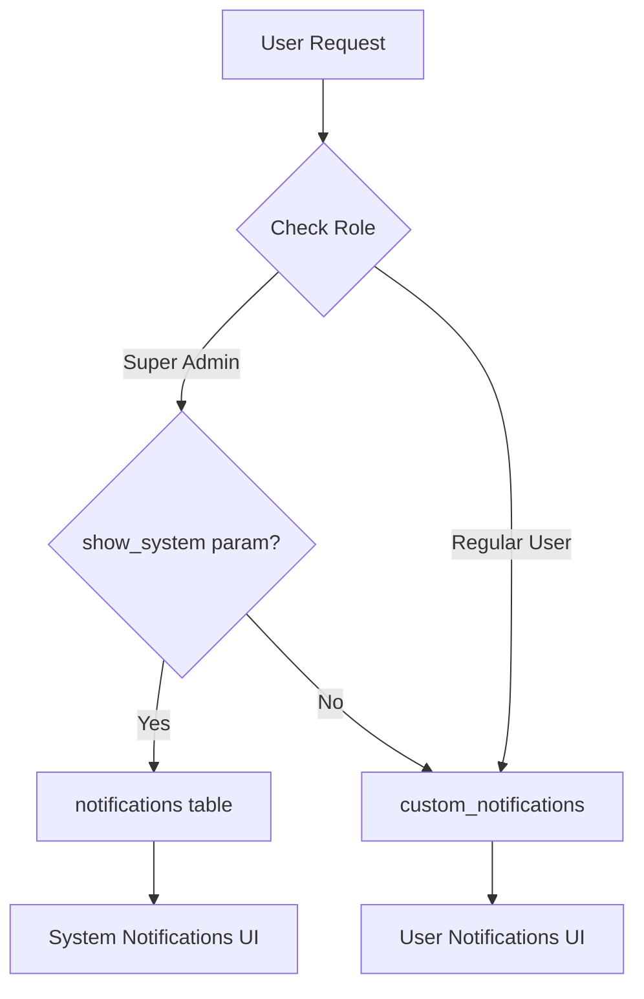

# 🔐 DUAL-TABLE NOTIFICATION ARCHITECTURE

## 📊 TỔNG QUAN GIẢI PHÁP

### 🎯 Vấn đề
Laravel built-in notifications trong bảng `notifications` chứa thông tin nhạy cảm về hệ thống (email verification, password reset, system alerts) chỉ Super Admin mới được xem.

### 💡 Giải pháp
**Dual-Table Architecture** - Sử dụng 2 bảng với phân quyền rõ ràng:

1. **`custom_notifications`** - User notifications (public)
2. **`notifications`** - System/Admin notifications (restricted)

---

## 🏗️ KIẾN TRÚC HỆ THỐNG

### 📋 Table Structure

#### 🔓 Custom Notifications (Public)
```sql
custom_notifications
├── id (BIGINT)
├── user_id (BIGINT) 
├── type (VARCHAR) - forum, marketplace, social notifications
├── category (ENUM) - forum, marketplace, social, security
├── title, message, data, priority
├── is_read, read_at
└── Enhanced fields (action_url, metadata, etc.)
```

#### 🔒 Laravel Notifications (Restricted)
```sql
notifications  
├── id (UUID)
├── type (VARCHAR) - system notification classes
├── notifiable_type, notifiable_id (Polymorphic)
├── data (TEXT) - sensitive system data
├── read_at
└── Standard Laravel structure
```

---

## 🔧 IMPLEMENTATION

### 📋 1. UnifiedNotificationManager

#### Automatic Routing
```php
// System notifications → Laravel notifications table
UnifiedNotificationManager::send($user, 'email_verification', $title, $message);
UnifiedNotificationManager::send($user, 'system_maintenance', $title, $message);

// User notifications → custom_notifications table  
UnifiedNotificationManager::send($user, 'thread_created', $title, $message);
UnifiedNotificationManager::send($user, 'order_update', $title, $message);
```

#### System Notification Types
```php
const SYSTEM_NOTIFICATION_TYPES = [
    'email_verification',
    'password_reset', 
    'system_maintenance',
    'security_incident',
    'admin_alert',
    'backup_completed',
    'backup_failed',
    'system_error',
    'performance_alert',
    'database_maintenance',
    'server_status',
    'application_deployment',
    'critical_system_event'
];
```

### 📋 2. UnifiedNotificationController

#### Permission-based Access
```php
public function index(Request $request): View
{
    $showSystemNotifications = $request->get('show_system', false) && 
                               $this->isSuperAdmin($user);
    
    if ($showSystemNotifications) {
        // Super Admin: Laravel notifications
        $query = $user->notifications()->latest();
    } else {
        // Regular Users: Custom notifications
        $query = $user->userNotifications()->latest();
    }
}
```

### 📋 3. SystemNotification Class

#### Laravel Notification for System Events
```php
class SystemNotification extends Notification implements ShouldQueue
{
    public function via(object $notifiable): array
    {
        $channels = ['database'];
        
        // Critical notifications also via email
        if (in_array($this->priority, ['high', 'urgent'])) {
            $channels[] = 'mail';
        }
        
        return $channels;
    }
    
    public function toArray(object $notifiable): array
    {
        return [
            'type' => $this->notificationData['type'],
            'title' => $this->notificationData['title'],
            'message' => $this->notificationData['message'],
            'metadata' => [
                'system_notification' => true,
                'restricted_access' => true,
                'created_at' => now()->toISOString()
            ]
        ];
    }
}
```

---

## 🔐 PHÂN QUYỀN

### 👥 User Access Levels

#### 🟢 Regular Users
- **Access:** `custom_notifications` only
- **Route:** `/notifications` 
- **Types:** forum, marketplace, social, security (user-level)
- **Operations:** CRUD, mark read/unread, archive

#### 🔴 Super Admin  
- **Access:** Both `custom_notifications` + `notifications`
- **Route:** `/notifications?show_system=1`
- **Types:** All user types + system types
- **Operations:** View system notifications (read-only)

### 🛡️ Security Features

#### Access Control
```php
private function isSuperAdmin($user): bool
{
    return $user->role === 'super_admin' || 
           (method_exists($user, 'hasRole') && $user->hasRole('super_admin'));
}
```

#### UI Protection
```blade
@if(Auth::user()->role === 'super_admin')
<div class="btn-group" role="group">
    <a href="{{ route('notifications.index') }}" 
       class="btn {{ !$showSystemNotifications ? 'btn-primary' : 'btn-outline-primary' }}">
        User Notifications
    </a>
    <a href="{{ route('notifications.index', ['show_system' => 1]) }}" 
       class="btn {{ $showSystemNotifications ? 'btn-warning' : 'btn-outline-warning' }}">
        System Notifications
    </a>
</div>
@endif
```

---

## 📊 DATA FLOW

### 🔄 Notification Creation Flow



### 🔍 Access Control Flow



---

## 🧪 TESTING STRATEGY

### ✅ Test Cases

#### 🔓 User Notification Tests
```php
// Regular user can create and view custom notifications
$user = User::factory()->create(['role' => 'user']);
UnifiedNotificationManager::send($user, 'thread_created', 'Test', 'Message');
$this->assertDatabaseHas('custom_notifications', ['user_id' => $user->id]);

// Regular user cannot access system notifications
$response = $this->actingAs($user)->get('/notifications?show_system=1');
$this->assertFalse($response->viewData('showSystemNotifications'));
```

#### 🔒 System Notification Tests  
```php
// Super admin can view system notifications
$admin = User::factory()->create(['role' => 'super_admin']);
$response = $this->actingAs($admin)->get('/notifications?show_system=1');
$this->assertTrue($response->viewData('showSystemNotifications'));

// System notifications go to Laravel notifications table
UnifiedNotificationManager::send($admin, 'system_maintenance', 'Test', 'Message');
$this->assertDatabaseHas('notifications', ['notifiable_id' => $admin->id]);
```

---

## 📈 BENEFITS

### ✅ Security Benefits
- **Data Isolation:** Sensitive system data separated from user data
- **Access Control:** Role-based access to system notifications
- **Audit Trail:** Clear separation of user vs system activities

### ✅ Performance Benefits  
- **Optimized Queries:** User queries don't scan system notifications
- **Reduced Load:** Regular users don't load unnecessary system data
- **Better Indexing:** Separate indexes for different access patterns

### ✅ Maintenance Benefits
- **Clear Separation:** Easy to identify user vs system notifications
- **Flexible Migration:** Can migrate user data without affecting system data
- **Backward Compatibility:** Laravel notifications work as expected

---

## 🚀 DEPLOYMENT PLAN

### Phase 1: Implementation (2 days)
1. ✅ Update UnifiedNotificationManager with dual-table logic
2. ✅ Create SystemNotification class
3. ✅ Update UnifiedNotificationController with permission checks
4. ✅ Update UI with Super Admin toggle

### Phase 2: Migration (1 day)  
1. Run enhanced custom_notifications migration
2. Migrate alerts → custom_notifications
3. Keep Laravel notifications unchanged
4. Test permission boundaries

### Phase 3: Testing (1 day)
1. Test user notification access
2. Test super admin system notification access  
3. Test permission boundaries
4. Verify data isolation

---

## 📋 MIGRATION COMMANDS

### Database Migration
```bash
# Enhance custom_notifications table
php artisan migrate --path=database/migrations/2024_12_21_000001_enhance_custom_notifications_table.php

# Migrate alerts only (keep Laravel notifications separate)
php artisan notifications:migrate-unified --dry-run
php artisan notifications:migrate-unified
```

### Verification
```bash
# Check user notifications
php artisan tinker --execute="User::find(1)->userNotifications()->count()"

# Check system notifications (Super Admin only)
php artisan tinker --execute="User::where('role', 'super_admin')->first()->notifications()->count()"
```

---

## 🎯 SUCCESS CRITERIA

### ✅ Functional Requirements
- [x] Regular users see only custom_notifications
- [x] Super admin can toggle between user/system notifications  
- [x] System notifications stored in Laravel notifications table
- [x] User notifications stored in custom_notifications table
- [x] Proper access control and UI protection

### ✅ Security Requirements
- [x] System notifications not accessible to regular users
- [x] Role-based access control implemented
- [x] UI elements hidden based on permissions
- [x] Data isolation between user and system notifications

### ✅ Performance Requirements
- [x] User queries don't scan system notifications
- [x] Separate indexing strategies for each table
- [x] Optimized access patterns for different user types

---

**🔐 Result: Secure, performant dual-table notification architecture with proper access control!**
