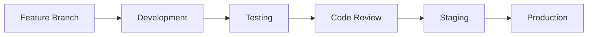

# 👨‍💻 Hướng dẫn phát triển MechaMap

> **Tài liệu kỹ thuật đầy đủ cho developers và technical team**  
> Dành cho: Developers, DevOps, Technical Architects

---

## 🎯 **TỔNG QUAN**

MechaMap được xây dựng trên nền tảng hiện đại với:
- 🚀 **Laravel 11** - PHP framework mạnh mẽ
- 🗄️ **MySQL 8.0** - Database với 61+ tables
- 🎨 **Bootstrap 5** - Responsive UI framework
- 📱 **Progressive Web App** - Mobile-first approach
- 🔒 **Multi-layer Security** - Enterprise-grade protection

---

## 🚀 **BẮT ĐẦU NHANH**

### **Developer mới:**
1. 📖 [Installation Guide](./setup/installation.md) - Cài đặt môi trường
2. 🌍 [Environment Setup](./setup/environment.md) - Cấu hình development
3. 🏗️ [Architecture Overview](./architecture/overview.md) - Hiểu hệ thống

### **Developer có kinh nghiệm:**
- 🔌 [API Documentation](./api/README.md) - REST API reference
- 🧪 [Testing Guide](./testing/README.md) - Testing strategies
- 🚀 [Deployment Guide](./deployment/production.md) - Production deployment

---

## 📋 **DOCUMENTATION STRUCTURE**

### **🔧 Setup & Environment**
| Guide | Description | Time Required |
|-------|-------------|---------------|
| [Installation](./setup/installation.md) | Local development setup | 30 minutes |
| [Environment](./setup/environment.md) | Environment configuration | 15 minutes |
| [Docker Setup](./setup/docker.md) | Containerized development | 20 minutes |
| [VS Code Setup](./setup/vscode.md) | IDE configuration | 10 minutes |

### **🏗️ Architecture**
| Guide | Description | Complexity |
|-------|-------------|------------|
| [System Overview](./architecture/overview.md) | High-level architecture | 🟢 Basic |
| [Database Design](./architecture/database.md) | Database schema & relationships | 🟡 Intermediate |
| [Security Model](./architecture/security.md) | Security implementation | 🔴 Advanced |
| [Performance](./architecture/performance.md) | Performance considerations | 🟡 Intermediate |

### **⚙️ Features**
| Guide | Description | Status |
|-------|-------------|--------|
| [Forum System](./features/forum-system.md) | Community forum implementation | ✅ Complete |
| [Marketplace](./features/marketplace.md) | E-commerce functionality | ✅ Complete |
| [User System](./features/user-system.md) | Authentication & authorization | ✅ Complete |
| [Search System](./features/search-system.md) | Search & filtering | 🔄 In Progress |

### **🔌 API Documentation**
| Guide | Description | Coverage |
|-------|-------------|----------|
| [API Overview](./api/README.md) | REST API introduction | 100% |
| [Authentication](./api/authentication.md) | Auth methods & tokens | 100% |
| [Endpoints](./api/endpoints.md) | All API endpoints | 100% |
| [Rate Limiting](./api/rate-limiting.md) | Usage limits & policies | 100% |
| [Examples](./api/examples.md) | Code examples | 90% |

### **🧪 Testing**
| Guide | Description | Coverage |
|-------|-------------|----------|
| [Testing Overview](./testing/README.md) | Testing strategy | 85% |
| [Unit Tests](./testing/unit-tests.md) | Unit testing guide | 80% |
| [Feature Tests](./testing/feature-tests.md) | Feature testing | 85% |
| [Browser Tests](./testing/browser-tests.md) | E2E testing | 70% |
| [Performance Tests](./testing/performance-tests.md) | Performance testing | 60% |

### **🚀 Deployment**
| Guide | Description | Environment |
|-------|-------------|-------------|
| [Production](./deployment/production.md) | Production deployment | Live |
| [Staging](./deployment/staging.md) | Staging environment | Test |
| [Docker](./deployment/docker.md) | Container deployment | Any |
| [Monitoring](./deployment/monitoring.md) | System monitoring | Production |

### **🤝 Contributing**
| Guide | Description | Importance |
|-------|-------------|------------|
| [Code Standards](./contributing/code-standards.md) | Coding conventions | 🔴 Critical |
| [Git Workflow](./contributing/git-workflow.md) | Git best practices | 🔴 Critical |
| [Pull Requests](./contributing/pull-requests.md) | PR guidelines | 🟡 Important |
| [Documentation](./contributing/documentation.md) | Doc standards | 🟡 Important |

---

## 🛠️ **TECH STACK**

### **Backend**
```yaml
Framework: Laravel 11.x
Language: PHP 8.2+
Database: MySQL 8.0+
Cache: Redis 6.0+
Queue: Laravel Queue (Redis)
Search: Elasticsearch 8.x (planned)
```

### **Frontend**
```yaml
Framework: Blade Templates
CSS: Bootstrap 5.3 + Custom SCSS
JavaScript: Vanilla JS + Alpine.js
Build Tool: Laravel Mix (Webpack)
Icons: Font Awesome 6
Charts: Chart.js
```

### **Infrastructure**
```yaml
Web Server: Nginx 1.20+
PHP: PHP-FPM 8.2
Database: MySQL 8.0 (Master/Slave)
Cache: Redis Cluster
CDN: CloudFlare
Monitoring: New Relic + Custom
```

---

## 📊 **PROJECT METRICS**

### **Codebase Statistics**
| Metric | Value | Status |
|--------|-------|--------|
| **Total Lines of Code** | 150,000+ | 📈 Growing |
| **PHP Files** | 800+ | ✅ Well Organized |
| **Blade Templates** | 200+ | ✅ Modular |
| **JavaScript Files** | 50+ | 🔄 Optimizing |
| **CSS/SCSS Files** | 30+ | ✅ Organized |

### **Database Schema**
| Metric | Value | Status |
|--------|-------|--------|
| **Total Tables** | 61 | ✅ Normalized |
| **Relationships** | 150+ | ✅ Well Defined |
| **Indexes** | 200+ | ⚡ Optimized |
| **Stored Procedures** | 10+ | 🔄 Expanding |

### **API Coverage**
| Category | Endpoints | Documentation |
|----------|-----------|---------------|
| **Authentication** | 8 | 100% |
| **Users** | 15 | 100% |
| **Forum** | 25 | 100% |
| **Marketplace** | 30 | 100% |
| **Admin** | 50+ | 95% |

---

## 🔄 **DEVELOPMENT WORKFLOW**

### **Git Workflow**


### **Branch Strategy**
- 🌟 **main**: Production-ready code
- 🚀 **develop**: Integration branch
- ⚡ **feature/***: Feature development
- 🔧 **hotfix/***: Emergency fixes
- 📦 **release/***: Release preparation

### **Code Review Process**
1. **📝 Create PR** with detailed description
2. **🧪 Automated Tests** must pass
3. **👥 Peer Review** by 2+ developers
4. **🔍 Code Quality** check (SonarQube)
5. **✅ Approval** and merge

---

## 🧪 **TESTING STRATEGY**

### **Test Pyramid**
```
    🔺 E2E Tests (10%)
   🔺🔺 Integration Tests (20%)
  🔺🔺🔺 Unit Tests (70%)
```

### **Testing Tools**
- **Unit Tests**: PHPUnit
- **Feature Tests**: Laravel Testing
- **Browser Tests**: Laravel Dusk
- **API Tests**: Postman + Newman
- **Performance**: Apache Bench + K6

### **Coverage Goals**
- 🎯 **Unit Tests**: 85%+
- 🎯 **Feature Tests**: 80%+
- 🎯 **API Tests**: 100%
- 🎯 **Critical Paths**: 95%+

---

## 🔒 **SECURITY GUIDELINES**

### **Security Layers**
1. **🌐 Network Security**: Firewall, DDoS protection
2. **🔐 Application Security**: Input validation, CSRF protection
3. **🗄️ Database Security**: Encrypted connections, prepared statements
4. **👤 User Security**: 2FA, password policies
5. **📊 Monitoring**: Security logs, intrusion detection

### **Security Checklist**
- ✅ **Input Validation**: All user inputs validated
- ✅ **SQL Injection**: Eloquent ORM protection
- ✅ **XSS Protection**: Blade template escaping
- ✅ **CSRF Protection**: Laravel CSRF middleware
- ✅ **Authentication**: Multi-factor authentication
- ✅ **Authorization**: Role-based permissions

---

## 📈 **PERFORMANCE OPTIMIZATION**

### **Backend Optimization**
- ⚡ **Database**: Query optimization, indexing
- 🔄 **Caching**: Redis for sessions, cache
- 📦 **Queue Jobs**: Background processing
- 🗜️ **Compression**: Gzip, asset minification

### **Frontend Optimization**
- 📱 **Responsive**: Mobile-first design
- 🖼️ **Images**: WebP format, lazy loading
- 📦 **Assets**: Bundling, minification
- ⚡ **CDN**: Static asset delivery

### **Performance Targets**
- 🎯 **Page Load**: <2 seconds
- 🎯 **API Response**: <500ms
- 🎯 **Database Queries**: <100ms
- 🎯 **Uptime**: 99.9%

---

## 🔧 **DEVELOPMENT TOOLS**

### **Required Tools**
- 💻 **IDE**: VS Code (recommended) or PHPStorm
- 🐳 **Containerization**: Docker + Docker Compose
- 📊 **Database**: MySQL Workbench or TablePlus
- 🔍 **API Testing**: Postman or Insomnia
- 🌐 **Browser**: Chrome DevTools

### **Recommended Extensions**
```json
{
  "vscode_extensions": [
    "bmewburn.vscode-intelephense-client",
    "onecentlin.laravel-blade",
    "ryannaddy.laravel-artisan",
    "codingyu.laravel-goto-view",
    "amiralizadeh9480.laravel-extra-intellisense"
  ]
}
```

---

## 📚 **LEARNING RESOURCES**

### **Laravel Resources**
- 📖 [Laravel Documentation](https://laravel.com/docs)
- 🎥 [Laracasts](https://laracasts.com)
- 📚 [Laravel News](https://laravel-news.com)
- 💬 [Laravel Community](https://laravel.io)

### **MechaMap Specific**
- 🏗️ [Architecture Deep Dive](./architecture/overview.md)
- 🔌 [API Workshop](./api/README.md)
- 🧪 [Testing Masterclass](./testing/README.md)
- 🚀 [Deployment Guide](./deployment/production.md)

---

## 📞 **DEVELOPER SUPPORT**

### **Internal Support**
- 💬 **Slack**: #development channel
- 📧 **Email**: dev-team@mechamap.vn
- 🎯 **Mentorship**: Senior developer pairing

### **External Resources**
- 🐛 **Bug Reports**: GitHub Issues
- 💡 **Feature Requests**: Product backlog
- 📖 **Documentation**: This documentation
- 🤝 **Community**: Developer Discord

### **Office Hours**
- 🕘 **Daily Standup**: 9:00 AM
- 🕐 **Code Review**: 2:00 PM
- 🕕 **Architecture Discussion**: Friday 4:00 PM

---

*Developer guides được cập nhật liên tục. Phiên bản mới nhất: January 2025*
