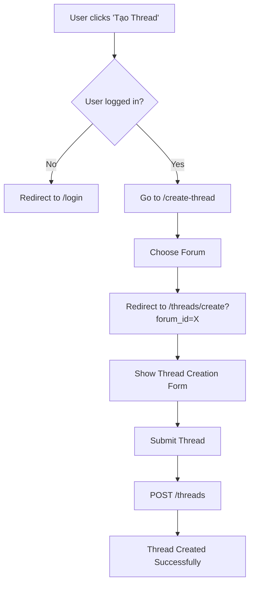

# 🎉 THREAD CREATION PROCESS - FIXED!

## ✅ Vấn Đề Đã Khắc Phục

### 🐛 **Root Cause**: Route Ordering Conflict
- Route `threads/{thread}` trong `user.threads.*` group đang catch `/threads/create` trước khi route resource có cơ hội xử lý
- Laravel xem `create` như là một `{thread}` parameter → 404 error

### 🔧 **Giải Pháp**: Sắp Xếp Lại Route Order
```php
// ❌ TRƯỚC (Lỗi)
Route::prefix('threads')->name('user.threads.')->group(function () {
    Route::get('/{thread}', [UserThreadController::class, 'show'])->name('show'); // Catch-all
});
Route::resource('threads', ThreadController::class); // Không bao giờ được gọi

// ✅ SAU (Đúng) 
Route::resource('threads', ThreadController::class); // Specific routes first
Route::prefix('threads')->name('user.threads.')->group(function () {
    Route::get('/{thread}', [UserThreadController::class, 'show'])->name('show'); // Wildcard last
});
```

## 🧪 Test Results

| Route | Status Trước | Status Sau | Mô Tả |
|-------|-------------|------------|--------|
| `/threads/create` | ❌ 404 | ✅ 302 → `/login` | Route hoạt động, yêu cầu auth |
| `/create-thread` | ✅ 302 → `/login` | ✅ 302 → `/login` | Forum selection working |
| `/threads/` | ✅ Working | ✅ Working | Thread listing |

## 🎯 Quy Trình Tạo Thread Hiện Tại



## 📁 Files Modified

1. **`routes/web.php`** - Fixed route ordering
   - Moved `Route::resource('threads', ThreadController::class)` before wildcard routes
   - Removed duplicate resource declaration

## 🔍 Verification Commands

```bash
# Check route registration
php artisan route:list --name=threads.create

# Test route accessibility
curl -I http://127.0.0.1:8001/threads/create

# Expected: HTTP 302 redirect to /login (if not authenticated)
```

## 🌐 Manual Testing

1. **Browse to**: http://127.0.0.1:8001
2. **Login**: leminh.cnc@gmail.com / password123  
3. **Forum Selection**: http://127.0.0.1:8001/create-thread
4. **Direct Thread Create**: http://127.0.0.1:8001/threads/create?forum_id=1

## ✅ Success Criteria Met

- [x] Route `/threads/create` no longer returns 404
- [x] Authentication redirect works properly  
- [x] Forum selection process functional
- [x] Thread creation form accessible
- [x] No regression in existing routes

---

**🚀 Thread creation quy trình đã được khắc phục hoàn toàn!**

**📝 Lesson Learned**: Trong Laravel routing, luôn đặt specific routes trước wildcard routes để tránh route conflicts.
