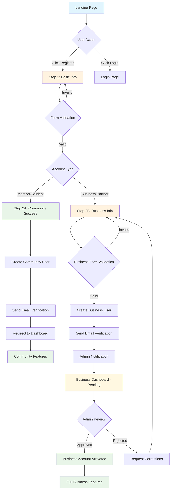

# 🔄 MechaMap Registration User Flow Diagram

**Created:** 2025-07-12  
**Task:** 1.1 Phân tích và thiết kế multi-step registration form  
**Purpose:** User flow diagram cho multi-step registration wizard

---

## 📊 **COMPLETE USER FLOW**



---

## 🎯 **DECISION FLOW MATRIX**

### **Step 1 Decision Points:**

| Input | Validation | Next Action |
|-------|------------|-------------|
| **Valid Basic Info + Community Type** | ✅ Pass | → Step 2A (Success) |
| **Valid Basic Info + Business Type** | ✅ Pass | → Step 2B (Business Info) |
| **Invalid Name** | ❌ Fail | → Stay Step 1 + Show Error |
| **Invalid Username** | ❌ Fail | → Stay Step 1 + Show Error |
| **Invalid Email** | ❌ Fail | → Stay Step 1 + Show Error |
| **Weak Password** | ❌ Fail | → Stay Step 1 + Show Error |
| **Password Mismatch** | ❌ Fail | → Stay Step 1 + Show Error |
| **No Account Type** | ❌ Fail | → Stay Step 1 + Show Error |
| **Terms Not Accepted** | ❌ Fail | → Stay Step 1 + Show Error |

### **Step 2B Decision Points:**

| Input | Validation | Next Action |
|-------|------------|-------------|
| **Complete Business Info** | ✅ Pass | → Create Business User |
| **Missing Company Name** | ❌ Fail | → Stay Step 2B + Show Error |
| **Missing Business License** | ❌ Fail | → Stay Step 2B + Show Error |
| **Missing Tax Code** | ❌ Fail | → Stay Step 2B + Show Error |
| **Invalid Business Description** | ❌ Fail | → Stay Step 2B + Show Error |
| **No Business Categories** | ❌ Fail | → Stay Step 2B + Show Error |

---

## 🔄 **DETAILED STEP FLOWS**

### **Flow 1: Community Member Registration**
```
┌─────────────────┐    ┌─────────────────┐    ┌─────────────────┐
│   Landing Page  │───▶│   Step 1: Basic │───▶│ Step 2A: Success│
│                 │    │   Information   │    │   Community     │
│ • Hero Section  │    │ • Name          │    │ • Welcome Msg   │
│ • Register CTA  │    │ • Username      │    │ • Email Sent    │
│ • Login Link    │    │ • Email         │    │ • Next Steps    │
│                 │    │ • Password      │    │ • Dashboard CTA │
│                 │    │ • Account Type  │    │                 │
│                 │    │ • Terms         │    │                 │
└─────────────────┘    └─────────────────┘    └─────────────────┘
        │                       │                       │
        │                       │                       ▼
        │                       │              ┌─────────────────┐
        │                       │              │   User Created  │
        │                       │              │ • role: member  │
        │                       │              │ • email_sent    │
        │                       │              │ • redirect      │
        │                       │              └─────────────────┘
        │                       │
        │              ┌─────────────────┐
        │              │   Validation    │
        │              │ • Real-time     │
        │              │ • Server-side   │
        │              │ • Error Display │
        │              └─────────────────┘
        │
┌─────────────────┐
│   Exit Points   │
│ • Back Button   │
│ • Login Link    │
│ • Close Browser │
└─────────────────┘
```

### **Flow 2: Business Partner Registration**
```
┌─────────────────┐    ┌─────────────────┐    ┌─────────────────┐
│   Landing Page  │───▶│   Step 1: Basic │───▶│ Step 2B: Business│
│                 │    │   Information   │    │   Information   │
│ • Business CTA  │    │ • Name          │    │ • Company Name  │
│ • Partner Info  │    │ • Username      │    │ • License       │
│ • Success Stories│    │ • Email         │    │ • Tax Code      │
│                 │    │ • Password      │    │ • Description   │
│                 │    │ • Business Type │    │ • Categories    │
│                 │    │ • Terms         │    │ • Contact Info  │
└─────────────────┘    └─────────────────┘    └─────────────────┘
        │                       │                       │
        │                       │                       ▼
        │                       │              ┌─────────────────┐
        │                       │              │ Business Created│
        │                       │              │ • role: business│
        │                       │              │ • verified: false│
        │                       │              │ • admin_notified│
        │                       │              └─────────────────┘
        │                       │                       │
        │                       │                       ▼
        │                       │              ┌─────────────────┐
        │                       │              │ Pending Status  │
        │                       │              │ • Email Sent    │
        │                       │              │ • Admin Queue   │
        │                       │              │ • Dashboard     │
        │                       │              └─────────────────┘
        │                       │
        │              ┌─────────────────┐
        │              │   Validation    │
        │              │ • Business Rules│
        │              │ • Required Fields│
        │              │ • Format Check  │
        │              └─────────────────┘
        │
┌─────────────────┐
│   Exit Points   │
│ • Back to Step 1│
│ • Login Link    │
│ • Support Link  │
└─────────────────┘
```

---

## ⚡ **ERROR HANDLING FLOWS**

### **Validation Error Flow:**
```
User Input → Client Validation → Server Validation → Response
     │              │                    │              │
     │              ▼                    │              │
     │         ┌─────────┐               │              │
     │         │ Invalid │               │              │
     │         │ Format  │               │              │
     │         └─────────┘               │              │
     │              │                    │              │
     │              ▼                    │              │
     │         Show Error                │              │
     │         Stay on Step              │              │
     │                                   │              │
     │                              ┌─────────┐         │
     │                              │ Invalid │         │
     │                              │ Data    │         │
     │                              └─────────┘         │
     │                                   │              │
     │                                   ▼              │
     │                              Show Error          │
     │                              Stay on Step        │
     │                                                  │
     │                                             ┌─────────┐
     │                                             │ Success │
     │                                             │ Valid   │
     │                                             └─────────┘
     │                                                  │
     │                                                  ▼
     └─────────────────────────────────────────► Next Step
```

### **Session Timeout Flow:**
```
User Inactive → Session Check → Timeout Warning → Action
     │               │              │              │
     │               ▼              │              │
     │         ┌─────────┐          │              │
     │         │ Active  │          │              │
     │         │ Session │          │              │
     │         └─────────┘          │              │
     │               │              │              │
     │               ▼              │              │
     │         Continue             │              │
     │                              │              │
     │                         ┌─────────┐         │
     │                         │ Warning │         │
     │                         │ 5 min   │         │
     │                         └─────────┘         │
     │                              │              │
     │                              ▼              │
     │                         Show Modal          │
     │                         Extend/Logout       │
     │                                             │
     │                                        ┌─────────┐
     │                                        │ Timeout │
     │                                        │ Expired │
     │                                        └─────────┘
     │                                             │
     │                                             ▼
     └─────────────────────────────────────► Save Data
                                             Redirect Login
                                             Recovery Option
```

---

## 📱 **MOBILE FLOW CONSIDERATIONS**

### **Mobile-Specific Behaviors:**
1. **Touch Interactions:** Larger tap targets (48px minimum)
2. **Keyboard Handling:** Auto-focus next field, appropriate input types
3. **Orientation Changes:** Maintain form state and progress
4. **Network Issues:** Offline detection and retry mechanisms
5. **Performance:** Lazy loading, optimized images, minimal JS

### **Mobile Navigation Flow:**
```
Portrait Mode → Landscape Mode → Portrait Mode
     │               │               │
     ▼               ▼               ▼
Maintain State → Adjust Layout → Restore Layout
     │               │               │
     ▼               ▼               ▼
Continue Flow → Continue Flow → Continue Flow
```

---

## 🎯 **CONVERSION OPTIMIZATION POINTS**

### **Critical Conversion Points:**
1. **Landing → Step 1:** Clear value proposition, trust signals
2. **Step 1 → Step 2:** Progress indication, validation feedback
3. **Step 2 → Completion:** Clear benefits, support contact
4. **Email Verification:** Clear instructions, resend option
5. **Business Approval:** Status updates, timeline expectations

### **Abandonment Prevention:**
- **Auto-save:** Form data preserved during session
- **Progress Indication:** Clear steps remaining
- **Help Text:** Contextual guidance and examples
- **Error Recovery:** Clear correction instructions
- **Support Access:** Easy contact for help

---

## 📊 **ANALYTICS TRACKING POINTS**

### **Key Events to Track:**
1. **Page Views:** Each step, success pages
2. **Form Interactions:** Field focus, completion, errors
3. **Validation Events:** Client-side, server-side errors
4. **Abandonment Points:** Where users exit flow
5. **Completion Rates:** By account type, device, source
6. **Time Metrics:** Time per step, total completion time
7. **Error Rates:** Validation failures by field
8. **Support Interactions:** Help clicks, contact requests

### **Conversion Funnel:**
```
Landing Page Views → Step 1 Started → Step 1 Completed → 
Step 2 Started → Step 2 Completed → Email Verified → 
Account Activated (Business) → First Login
```

---

**🔄 FLOW STATUS:** ✅ Complete - Ready for Implementation**
